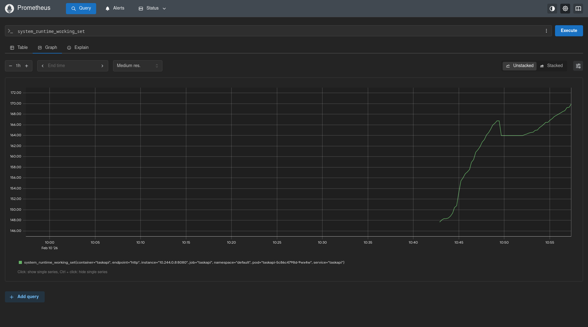

# Self-Healing System DemoApp

A small ASP.NET Core + React demo used to explore self-healing workflows on Kubernetes with Prometheus metrics.

## Project Structure
- TaskApi/ - ASP.NET Core API with health, stress, and Prometheus metrics.
- task-frontend/ - React + Vite UI (optional for local usage).
- TaskApi/Kubernetes/ - Deployment, Service, and ServiceMonitor manifests.
- Metrics/ - Screenshots used in this documentation.

## Architecture Overview
- API exposes:
  - /health for liveness/readiness
  - /metrics for Prometheus scraping
  - /stress/cpu?seconds=15 to generate CPU load
- Prometheus scrapes /metrics via ServiceMonitor.
- The kind cluster runs the API as a Deployment + Service.

## Local Development (Docker Compose)
From the repo root:

```bash
cp .env.example .env
# Edit .env to set POSTGRES_PASSWORD and CONNECTION_STRING

docker-compose up
```

API runs on http://localhost:5000 (see TaskApi/appsettings.json for applicationUrl).

## Kubernetes + kind
Build and load the image into kind:

```bash
cd TaskApi

docker build -t taskapi:1.0 .
kind load docker-image taskapi:1.0 --name self-healing
```

Deploy the API:

```bash
kubectl apply -f TaskApi/Kubernetes/deployment.yaml
kubectl apply -f TaskApi/Kubernetes/service.yaml
```

Port forward and test:

```bash
kubectl port-forward svc/taskapi 8080:80

curl localhost:8080/health
curl localhost:8080/stress/cpu?seconds=15
curl localhost:8080/metrics
```

## Observability (Prometheus)
Install Prometheus (Helm):

```bash
helm repo add prometheus-community https://prometheus-community.github.io/helm-charts
helm repo update
helm install prometheus prometheus-community/kube-prometheus-stack \
  --set prometheus.prometheusSpec.serviceMonitorSelectorNilUsesHelmValues=false \
  --namespace monitoring --create-namespace
```

Apply the ServiceMonitor:

```bash
kubectl apply -f TaskApi/Kubernetes/service-monitor.yaml
```

Port forward Prometheus:

```bash
kubectl port-forward -n monitoring svc/prometheus-kube-prometheus-prometheus 9090:9090
```

Open http://localhost:9090 and run queries:
- system_runtime_working_set
- http_requests_received_total
- process_cpu_seconds_total

## Metrics Screenshots
Prometheus time series collection view:


System runtime working set metric:



## Notes
- The API listens on port 8080 inside the container.
- TaskApi/Kubernetes/service.yaml exposes a named port "http" for ServiceMonitor discovery.
- TaskApi/Kubernetes/deployment.yaml uses imagePullPolicy: Never for kind local images.
