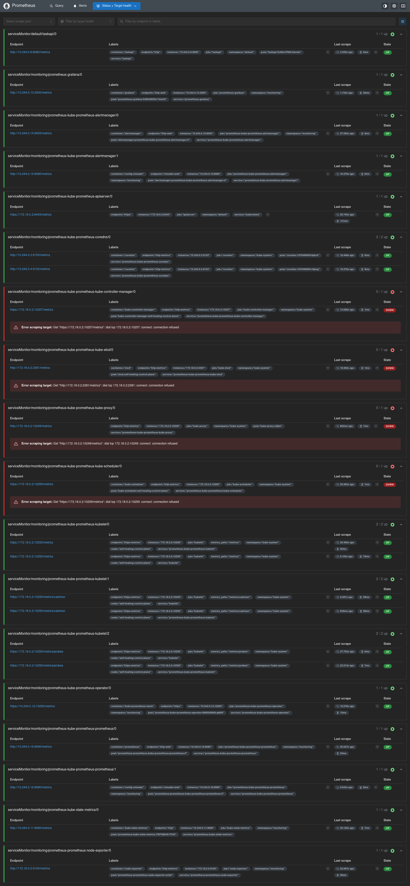
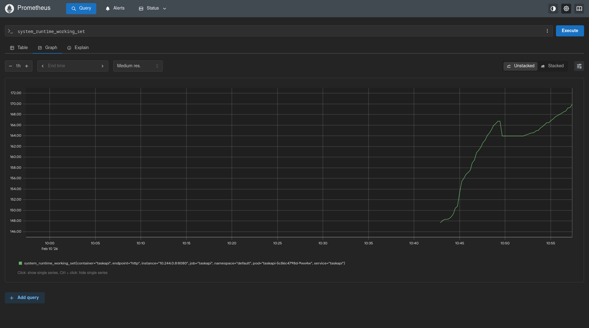

# Self-Healing System

A Kubernetes-based **truly self-healing system** that automatically detects anomalies, diagnoses root causes through signal correlation, selects multi-step remediation strategies, and learns from past recovery outcomes to improve future decisions.

---

## Architecture

```
┌─────────────┐    ┌─────────────┐    ┌──────────────┐    ┌────────────┐
│  React UI   │───▶│   TaskApi    │◀───│   Analyzer    │───▶│ Kubernetes │
│  (Vite)     │    │  (.NET 8)   │    │  (.NET 9)     │    │  API       │
└─────────────┘    └──────┬──────┘    └───────┬───────┘    └────────────┘
                          │                   │
                   ┌──────▼──────┐    ┌───────▼───────┐
                   │ PostgreSQL  │    │  Prometheus    │
                   │   16        │    │  (Scraping)    │
                   └─────────────┘    └───────────────┘
```

### Intelligence Pipeline

```
 Prometheus Metrics ──┐
  (memory, CPU,      │    ┌───────────────┐     ┌──────────────────┐     ┌──────────────┐
   error rate,       ├───▶│ Anomaly Rules │────▶│ Root Cause       │────▶│ Remediation  │
   request rate)     │    │ (3 detectors) │     │ Diagnosis        │     │ Engine       │
                     │    └───────────────┘     │ (signal          │     │ (multi-step  │
                     │                          │  correlation)    │     │  strategies) │
                     │                          └──────────────────┘     └──────┬───────┘
                     │                                                         │
                     │    ┌───────────────────────────────────────────────────┐ │
                     └───▶│ Learning Loop (records outcomes, recommends      │◀┘
                          │ best strategies based on historical success rate)│
                          └───────────────────────────────────────────────────┘
```

| Component       | Tech Stack                          | Purpose                                    |
|----------------|-------------------------------------|--------------------------------------------|
| **TaskApi**     | ASP.NET Core 8, EF Core, Npgsql    | REST API, data persistence, Prometheus metrics |
| **Analyzer**    | ASP.NET Core 9, KubernetesClient    | Anomaly detection, diagnosis, remediation, learning |
| **Frontend**    | React 19, Vite, Tailwind CSS v4, Recharts, Radix UI | Dashboard, monitoring, task management |
| **PostgreSQL**  | PostgreSQL 16                       | Data store for tasks, metrics, failures, recoveries |
| **Prometheus**  | prom/prometheus                     | Metrics scraping (5s interval)             |
| **Grafana**     | Grafana 11.0.0                      | Metrics visualization dashboards           |
| **Kubernetes**  | Kind (Kubernetes in Docker)         | Container orchestration                    |

### How It Works

1. **Prometheus** scrapes `/metrics` from TaskApi every 5 seconds
2. **Analyzer** queries Prometheus for 4 metrics in parallel every 5 seconds:
   - Memory working set (`system_runtime_working_set`)
   - CPU usage percent (`rate(process_cpu_seconds_total)`)
   - HTTP error rate (`rate(5xx) / rate(total)`)
   - Request rate (`rate(http_requests_received_total)`)
3. **Three anomaly detection rules** evaluate sliding windows:
   - **MemoryLeakRule** — 8 samples, triggers if memory slope > 15 MB/min, 3-min cooldown
   - **CpuSpikeRule** — 10 samples, triggers if 7/10 samples > 80% CPU, 5-min cooldown, critical > 95%
   - **HighErrorRateRule** — 6 samples, triggers if 4/6 samples > 10% error rate, 3-min cooldown
4. On anomaly, **DiagnosticService** correlates all metrics to classify root cause:
   - `ResourceExhaustion` — high memory + high CPU + low traffic
   - `TrafficOverload` — high traffic + high errors + high CPU
   - `ApplicationError` — high errors + low traffic
   - `DependencyFailure` — high traffic + high errors + low CPU/memory
   - `MemoryLeakSuspected` — high memory only
   - `HighCpuUsage` — high CPU only
5. **RemediationEngine** selects multi-step strategy based on diagnosis:
   - `RestartWithBuffer` — ScaleUp → RestartPod (for memory leaks)
   - `ScaleUpAggressive` — ScaleUp (for traffic overload)
   - `ScaleAndRestart` — ScaleUp → RestartPod (for dependency failures)
   - `RestartAndMonitor` — RestartPod (for application errors)
   - Each strategy executes steps sequentially with configurable delays
6. **LearningService** records every recovery outcome and recommends strategies with the highest historical success rate (requires ≥3 samples at >70% success to override defaults)
7. **Frontend** displays real-time dashboard with metrics, failures, and recovery status

---

## Prerequisites

| Tool       | Version  | Purpose                    |
|------------|----------|----------------------------|
| Docker     | 20+      | Container runtime          |
| Kind       | 0.20+    | Local Kubernetes cluster   |
| kubectl    | 1.28+    | Kubernetes CLI             |
| .NET SDK   | 8.0      | Build TaskApi              |
| .NET SDK   | 9.0      | Build Analyzer             |
| Node.js    | 20+      | Frontend development       |
| npm        | 10+      | Package management         |

---

## Quick Start

### Automated Installation (Recommended)

The install script checks for and installs all prerequisites, creates the Kind cluster, builds Docker images, deploys to Kubernetes, and installs frontend dependencies.

```bash
cd DemoApp

# Make scripts executable
chmod +x install.sh run.sh

# Install everything
./install.sh

# Start all services
./run.sh
```

### Manual Installation

#### 1. Create Kind Cluster

```bash
kind create cluster --name self-healing
```

#### 2. Build Docker Images

```bash
# TaskApi
docker build -t taskapi:latest -f TaskApi/Dockerfile TaskApi/

# Analyzer
docker build -t analyzer:latest -f Analyzer/Dockerfile Analyzer/

# Load into Kind
kind load docker-image taskapi:latest --name self-healing
kind load docker-image analyzer:latest --name self-healing
```

#### 3. Deploy to Kubernetes

```bash
kubectl apply -f k8s/postgres.yaml
kubectl apply -f k8s/prometheus.yaml
kubectl apply -f k8s/grafana.yaml
kubectl apply -f k8s/rbac.yaml
kubectl apply -f k8s/taskapi.yaml

# Wait for Postgres
kubectl rollout status deployment/postgres --timeout=120s

kubectl apply -f k8s/analyzer.yaml

# Restart deployments to pick up fresh images
kubectl rollout restart deployment/taskapi
kubectl rollout restart deployment/analyzer

kubectl rollout status deployment/taskapi --timeout=120s
kubectl rollout status deployment/analyzer --timeout=120s
```

#### 4. Start Port Forwards

```bash
kubectl port-forward svc/taskapi    5186:80   &
kubectl port-forward svc/analyzer   5297:80   &
kubectl port-forward svc/grafana    3000:3000 &
kubectl port-forward svc/prometheus 9090:9090 &
```

#### 5. Start Frontend

```bash
cd task-frontend
npm install
npm run dev
```

---

## Service URLs

| Service      | URL                           | Credentials   |
|-------------|-------------------------------|---------------|
| Frontend     | http://localhost:5173         | —             |
| TaskApi      | http://localhost:5186         | —             |
| Analyzer     | http://localhost:5297         | —             |
| Grafana      | http://localhost:3000         | admin / admin |
| Prometheus   | http://localhost:9090         | —             |

---

## Testing the Self-Healing

### Trigger a Memory Leak

```bash
# Allocate 200MB (will not be garbage collected)
curl "http://localhost:5186/stress/memory?mb=200"

# Repeat a few times to trigger detection
curl "http://localhost:5186/stress/memory?mb=200"
curl "http://localhost:5186/stress/memory?mb=200"
```

### Watch the Recovery

```bash
# Check analyzer status
curl http://localhost:5297/status | jq

# View detected failures
curl "http://localhost:5186/api/failureevents?resolved=false" | jq

# View recovery actions
curl http://localhost:5186/api/recoveryactions | jq

# Watch pods (should see restart/scaling)
kubectl get pods -w
```

### CPU Stress Test

```bash
curl "http://localhost:5186/stress/cpu?seconds=30"
```

---

## API Documentation

Full API reference is available in [docs/API.md](docs/API.md).

### Quick Reference

| Method  | Endpoint                                 | Description              |
|---------|------------------------------------------|--------------------------|
| GET     | `/api/tasks`                             | List tasks               |
| POST    | `/api/tasks`                             | Create task              |
| DELETE  | `/api/tasks/{id}`                        | Delete task              |
| GET     | `/api/failureevents`                     | List failure events      |
| POST    | `/api/failureevents`                     | Create failure event     |
| PATCH   | `/api/failureevents/{id}/resolve`        | Resolve failure          |
| GET     | `/api/recoveryactions`                   | List recovery actions    |
| POST    | `/api/recoveryactions`                   | Create recovery action   |
| PATCH   | `/api/recoveryactions/{id}/status`       | Update action status     |
| GET     | `/api/metrics`                           | List metrics             |
| POST    | `/api/metrics`                           | Batch insert metrics     |
| GET     | `/health`                                | Health check             |
| GET     | `/stress/cpu?seconds=10`                 | CPU stress test          |
| GET     | `/stress/memory?mb=100`                  | Memory leak test         |
| GET     | `/metrics`                               | Prometheus metrics       |
| GET     | `/status`                                | Analyzer status          |
| GET     | `/events`                                | Analyzer failure events  |
| GET     | `/recoveries`                            | Analyzer recovery log    |

---

## Metrics Screenshots

Prometheus time series collection view:



System runtime working set metric:



---

## Project Structure

```
DemoApp/
├── install.sh                  # Automated installation script (Linux)
├── run.sh                      # Start all services (port-forwards + frontend)
├── docker-compose.yml          # Alternative: Docker Compose setup
├── docs/
│   └── API.md                  # Full API documentation
├── k8s/                        # Kubernetes manifests
│   ├── analyzer.yaml           # Analyzer deployment + service
│   ├── deploy.sh               # K8s deployment script
│   ├── grafana.yaml            # Grafana with Prometheus datasource
│   ├── port-forward.sh         # Port-forward helper
│   ├── postgres.yaml           # PostgreSQL with PVC
│   ├── prometheus.yaml         # Prometheus with scrape config
│   ├── rbac.yaml               # ServiceAccount + RBAC for Analyzer
│   └── taskapi.yaml            # TaskApi deployment + service
├── TaskApi/                    # .NET 8 REST API
│   ├── Dockerfile
│   ├── Program.cs              # App configuration (CORS, EF, Prometheus)
│   ├── Controllers/
│   │   ├── TasksController.cs
│   │   ├── FailureEventsController.cs
│   │   ├── RecoveryActionsController.cs
│   │   ├── MetricsController.cs
│   │   ├── HealthController.cs
│   │   └── StressController.cs
│   ├── Data/
│   │   └── AppDbContext.cs     # EF Core context (4 DbSets)
│   ├── Domain/
│   │   ├── FailureEvent.cs
│   │   ├── MetricRecord.cs
│   │   └── RecoveryAction.cs
│   └── Models/
│       └── TaskItem.cs
├── Analyzer/                   # .NET 9 monitoring service
│   ├── Dockerfile
│   ├── Program.cs              # Minimal API (status, events, recoveries)
│   ├── PrometheusClient.cs     # Prometheus query client
│   ├── Domains/
│   │   ├── FailureEvent.cs
│   │   ├── MetricSample.cs
│   │   └── MonitoringState.cs
│   ├── Rules/
│   │   └── MemoryLeakRule.cs   # Sliding window anomaly detection
│   └── Service/
│       └── MonitoringService.cs # Background monitoring loop
└── task-frontend/              # React 19 + Vite + Tailwind CSS v4
    ├── package.json
    ├── vite.config.js
    └── src/
        ├── App.jsx
        ├── api.js              # API client functions
        ├── lib/utils.js        # Utility helpers
        └── components/
            ├── ui/             # shadcn-style UI primitives
            ├── Header.jsx
            ├── DashboardTab.jsx
            ├── TasksTab.jsx
            ├── FailuresTab.jsx
            ├── RecoveriesTab.jsx
            ├── MetricsTab.jsx
            └── NotificationPanel.jsx
```

---

## Configuration

### TaskApi (`TaskApi/appsettings.json`)

```json
{
  "ConnectionStrings": {
    "DefaultConnection": "Host=localhost;Port=5432;Database=taskapi;Username=postgres;Password=postgres"
  },
  "Cors": {
    "AllowedOrigins": ["http://localhost:5173"]
  }
}
```

> In Kubernetes, the connection string is overridden via environment variable:
> `Host=postgres;Port=5432;Database=taskapi;Username=postgres;Password=postgres`

### Analyzer (`Analyzer/appsettings.json`)

```json
{
  "Endpoints": {
    "PrometheusBaseUrl": "http://localhost:9090",
    "TaskApiBaseUrl": "http://localhost:5186"
  },
  "Kubernetes": {
    "Namespace": "default",
    "TargetDeployment": "taskapi",
    "ScaleUpReplicas": 3
  }
}
```

> In Kubernetes, endpoints resolve via service names: `http://prometheus:9090`, `http://taskapi`.

### Frontend Environment

| Variable              | Default                    | Description       |
|----------------------|----------------------------|-------------------|
| `VITE_API_URL`       | `http://localhost:5186`    | TaskApi base URL  |
| `VITE_ANALYZER_URL`  | `http://localhost:5297`    | Analyzer base URL |

---

## Docker Compose (Alternative)

For non-Kubernetes local development:

```bash
docker-compose up -d
```

This starts:
- **PostgreSQL 16** on port 5432
- **TaskApi** on port 5000
- **Grafana** on port 3000

> Note: Docker Compose does not include the Analyzer or Prometheus. Use Kubernetes deployment for the full self-healing experience.

---

## Kubernetes Resources

| Resource           | Type         | Port(s)        | Notes                          |
|-------------------|--------------|----------------|--------------------------------|
| `taskapi`          | Deployment   | 8080 (→ 80)   | Liveness + readiness probes    |
| `analyzer`         | Deployment   | 8080 (→ 80)   | ServiceAccount: `analyzer-sa`  |
| `postgres`         | Deployment   | 5432           | 1Gi PVC for data               |
| `prometheus`       | Deployment   | 9090           | Scrapes TaskApi every 5s       |
| `grafana`          | Deployment   | 3000           | NodePort 32322, auto-provisioned |
| `analyzer-sa`      | ServiceAccount | —            | RBAC for pod/deployment access |
| `analyzer-role`    | Role         | —              | get/list/patch/update/delete   |
| `postgres-pvc`     | PVC          | —              | 1Gi ReadWriteOnce              |

---

## Troubleshooting

### Pods not starting
```bash
kubectl get pods
kubectl describe pod <pod-name>
kubectl logs <pod-name>
```

### Port-forward not working
```bash
# Kill existing port-forwards
fuser -k 5186/tcp 5297/tcp 3000/tcp 9090/tcp

# Restart
kubectl port-forward svc/taskapi 5186:80 &
```

### Rebuild after code changes
```bash
# Rebuild and redeploy
docker build -t taskapi:latest -f TaskApi/Dockerfile TaskApi/
docker build -t analyzer:latest -f Analyzer/Dockerfile Analyzer/
kind load docker-image taskapi:latest --name self-healing
kind load docker-image analyzer:latest --name self-healing
kubectl rollout restart deployment/taskapi deployment/analyzer
```

### Reset the cluster
```bash
kind delete cluster --name self-healing
./install.sh
```

---

## License

See [LICENSE](../LICENSE) for details.
