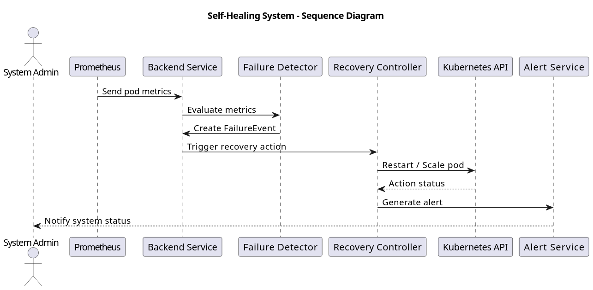
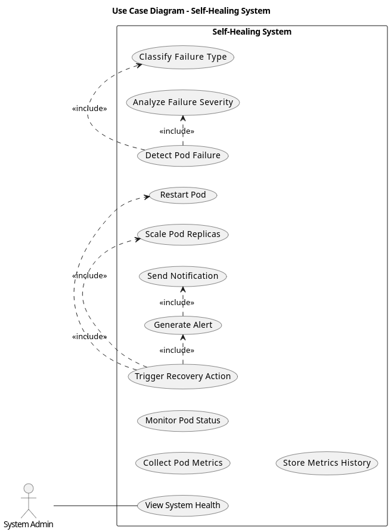
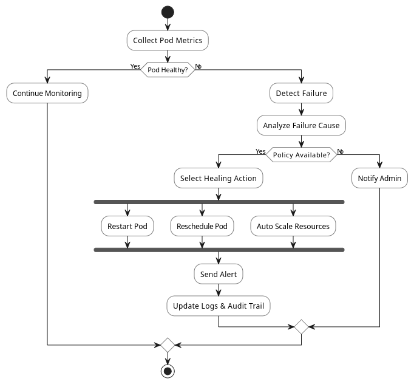
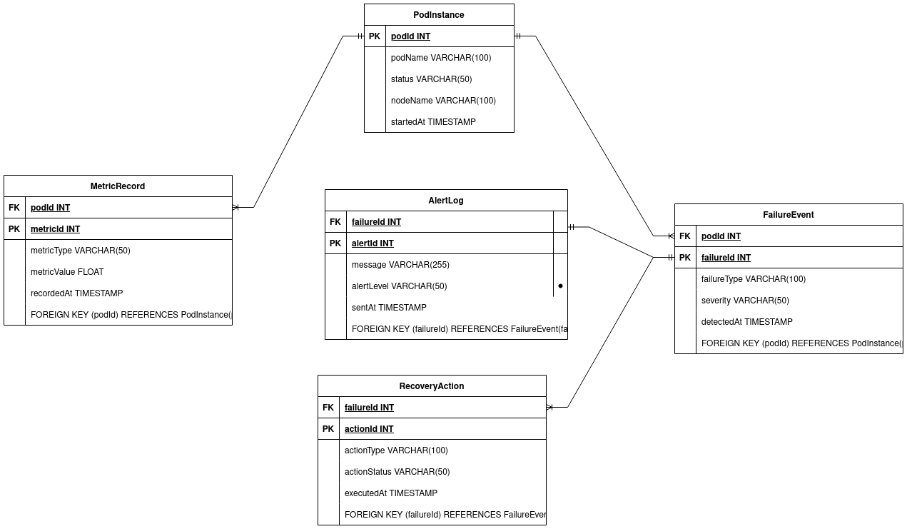

# Self-Healing-System
 Self-Healing System – UML Class Diagram

A comprehensive self-healing system designed to automatically detect, diagnose, and recover from failures in distributed systems. This project includes UML class diagrams and ER diagrams to illustrate the system architecture and database design.

## 📋 Overview

The Self-Healing System is an intelligent infrastructure management solution that monitors system health, identifies anomalies, and automatically applies corrective actions to maintain optimal performance and availability.

## 🎯 Features

- **Automated Failure Detection**: Continuous monitoring of system components
- **Self-Diagnosis**: Intelligent analysis of system issues
- **Automatic Recovery**: Predefined and adaptive recovery strategies
- **Scalable Architecture**: Designed for distributed systems
- **Comprehensive Logging**: Detailed event tracking and audit trails

## 📊 System Architecture

### UML Class Diagram

The system architecture is documented in the UML class diagram, which illustrates the relationships between key components:

### Sequence Diagram.

### Use-Case Diagram

### UML-Activity Diagram

### ER Diagrams

The database schema and entity relationships are visualized in multiple ER diagram versions:

#### Primary ER Diagram

#### Relational Table 

## 📖 Documentation

- Read the [docs](DemoApp/README.md)
- **UML Class Diagram**: Defines the object-oriented structure and relationships
- **ER Diagrams**: Define the database schema and entity relationships

## 📄 License

This project is licensed under the terms specified in the [LICENSE](LICENSE) file.

- GitHub: [@mukund58](https://github.com/mukund58)
