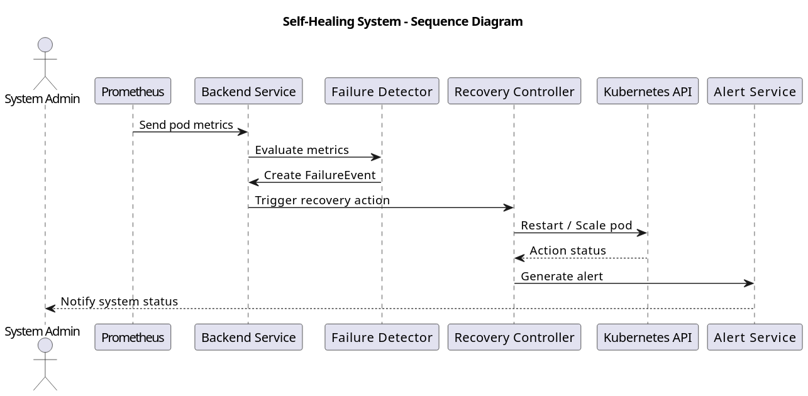
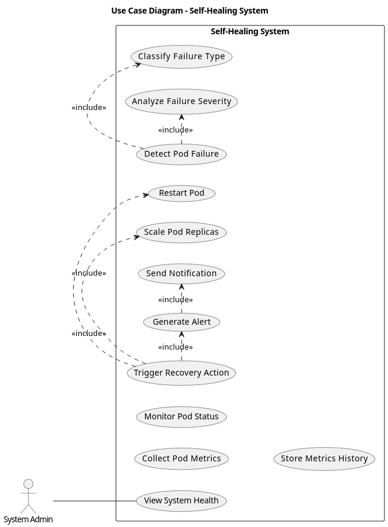
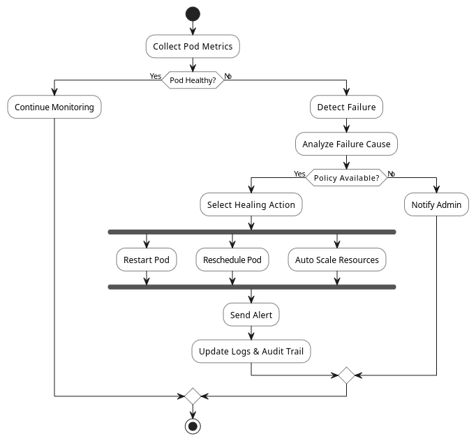
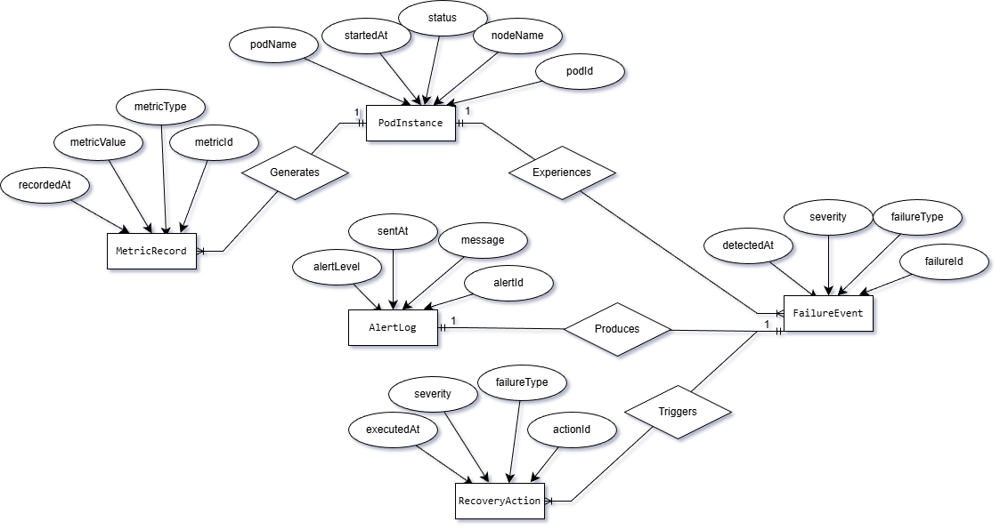
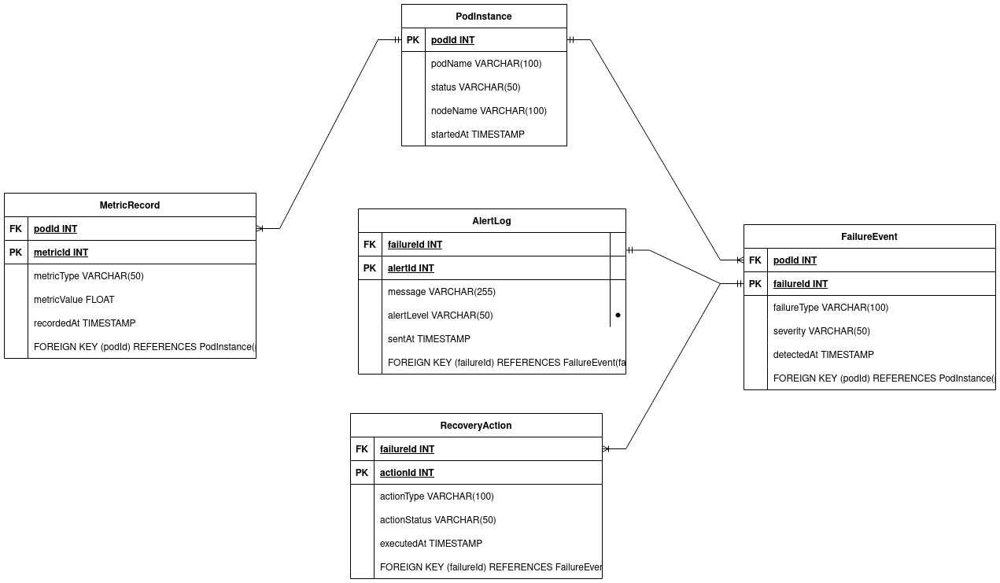

# Self-Healing System

A Kubernetes-based **truly self-healing system** that automatically detects anomalies across multiple signals, diagnoses root causes through metric correlation, executes multi-step remediation strategies, and learns from past recovery outcomes — with a React dashboard for real-time monitoring.

## 📋 Overview

The Self-Healing System monitors application health via Prometheus metrics, detects anomalies using sliding-window analysis across memory, CPU, and error rates, correlates signals to diagnose root causes, selects intelligent multi-step recovery strategies, and learns from historical outcomes to improve future decisions.

```
┌──────────────────────────┐
│   Learning Loop          │   ✅ BUILT — records outcomes, recommends strategies
│  (improves over time)    │
└──────────▲───────────────┘
           │
┌──────────┴───────────────┐
│   Remediation Engine     │   ✅ BUILT — multi-step strategies per root cause
│  (ScaleUp → Restart)     │
└──────────▲───────────────┘
           │
┌──────────┴───────────────┐
│   Root Cause Diagnosis   │   ✅ BUILT — correlates memory + CPU + errors + traffic
│  (signal correlation)    │
└──────────▲───────────────┘
           │
┌──────────┴───────────────┐
│   Anomaly Detection      │   ✅ BUILT — 3 rules: Memory, CPU, Error Rate
│  (sliding windows)       │
└──────────▲───────────────┘
           │
┌──────────┴───────────────┐
│   Observability Layer    │   ✅ BUILT — Prometheus (4 metrics) + health checks
│  (metrics + health)      │
└──────────────────────────┘
```

## 🎯 Features

- **Multi-Signal Anomaly Detection** — 3 sliding-window rules for memory leaks, CPU spikes, and high error rates
- **Root Cause Diagnosis** — Correlates 4 metrics (memory, CPU, error rate, request rate) to classify failures: ResourceExhaustion, TrafficOverload, ApplicationError, DependencyFailure, MemoryLeakSuspected, HighCpuUsage
- **Strategic Remediation** — Multi-step recovery strategies (e.g., ScaleUp → wait → RestartPod) selected per root cause
- **Learning Loop** — Records every recovery outcome and recommends the best strategy based on historical success rates
- **Full Persistence** — Failure events, recovery actions, and metrics stored in PostgreSQL
- **Real-Time Dashboard** — React 19 + Tailwind CSS v4 + Recharts with live metrics, failures, and recoveries
- **Stress Testing** — Built-in endpoints to simulate memory leaks and CPU exhaustion
- **Comprehensive API** — 20 REST endpoints across TaskApi and Analyzer services

---

## 📚 Documentation

| Document | Description |
|----------|-------------|
| [**DemoApp/README.md**](DemoApp/README.md) | Full setup guide — architecture, installation, configuration, troubleshooting |
| [**DemoApp/docs/API.md**](DemoApp/docs/API.md) | Complete API reference — all 18 endpoints, request/response examples, data models |
| [**DemoApp/install.sh**](DemoApp/install.sh) | Automated Linux install script — installs all prerequisites and deploys to K8s |
| [**DemoApp/run.sh**](DemoApp/run.sh) | Run script — starts port-forwards and frontend dev server |

### Quick Start

```bash
cd DemoApp
chmod +x install.sh run.sh

# Install everything (Docker, Kind, kubectl, .NET, Node.js, K8s cluster)
./install.sh

# Start all services
./run.sh
```

> See [DemoApp/README.md](DemoApp/README.md) for manual installation and detailed configuration.

---

## 🏗️ Architecture

```
┌─────────────┐    ┌─────────────┐    ┌──────────────┐    ┌────────────┐
│  React UI   │───▶│   TaskApi    │◀───│   Analyzer    │───▶│ Kubernetes │
│  (Vite)     │    │  (.NET 8)   │    │  (.NET 9)     │    │  API       │
└─────────────┘    └──────┬──────┘    └───────┬───────┘    └────────────┘
                          │                   │
                   ┌──────▼──────┐    ┌───────▼───────┐
                   │ PostgreSQL  │    │  Prometheus    │
                   │   16        │    │  (Scraping)    │
                   └─────────────┘    └───────────────┘
```

| Component       | Tech Stack                                           | Purpose                                    |
|----------------|------------------------------------------------------|--------------------------------------------|
| **TaskApi**     | ASP.NET Core 8, EF Core, Npgsql, prometheus-net      | REST API, data persistence, Prometheus metrics |
| **Analyzer**    | ASP.NET Core 9, KubernetesClient                     | Anomaly detection, recovery orchestration  |
| **Frontend**    | React 19, Vite, Tailwind CSS v4, Recharts, Radix UI  | Dashboard, monitoring, task management     |
| **PostgreSQL**  | PostgreSQL 16                                         | Tasks, metrics, failures, recoveries       |
| **Prometheus**  | prom/prometheus                                       | Metrics scraping (5s interval)             |
| **Grafana**     | Grafana 11.0.0                                        | Metrics visualization                      |
| **Kubernetes**  | Kind (Kubernetes in Docker)                           | Container orchestration                    |

---

## 📊 System Design Diagrams

The UML and ER diagrams document the full system design and data model.

### Sequence Diagram


### Use-Case Diagram


### UML Activity Diagram


### ER Diagrams

The database schema and entity relationships are visualized in multiple ER diagram versions:

#### Primary ER Diagram


#### Relational Table 


---

## ✅ How To Use In Your Project

If you want to apply the self-healing approach in your own system, use this demo as a reference and follow these steps.

### 1) Add Health And Metrics Endpoints

- Implement a `/health` endpoint that returns `503` when the service is unhealthy.
- Expose `/metrics` for Prometheus scraping.

Reference files:
- [DemoApp/TaskApi/Controllers/HealthController.cs](DemoApp/TaskApi/Controllers/HealthController.cs)
- [DemoApp/TaskApi/Program.cs](DemoApp/TaskApi/Program.cs)

### 2) Add Stress Or Failure Simulation (Optional)

Use stress endpoints to validate healing behavior during load or failure scenarios.

Reference file:
- [DemoApp/TaskApi/Controllers/StressController.cs](DemoApp/TaskApi/Controllers/StressController.cs)

### 3) Deploy With Kubernetes Probes

- Configure liveness and readiness probes to call `/health`.
- Kubernetes will restart unhealthy pods automatically.

Reference file:
- [DemoApp/TaskApi/Kubernetes/deployment.yaml](DemoApp/TaskApi/Kubernetes/deployment.yaml)

### 4) Add Prometheus Monitoring

- Install Prometheus.
- Add a ServiceMonitor to scrape `/metrics`.

Reference files:
- [DemoApp/TaskApi/Kubernetes/service.yaml](DemoApp/TaskApi/Kubernetes/service.yaml)
- [DemoApp/TaskApi/Kubernetes/service-monitor.yaml](DemoApp/TaskApi/Kubernetes/service-monitor.yaml)
- [DemoApp/TaskApi/Kubernetes/prometheus.yaml](DemoApp/TaskApi/Kubernetes/prometheus.yaml)

### 5) Run Locally (Optional)

Use Docker Compose to run the API and database locally.

Reference file:
- [DemoApp/docker-compose.yml](DemoApp/docker-compose.yml)

### 6) Adapt To Your Service

- Replace the Task API endpoints with your own business logic.
- Keep the health checks and metrics as part of your service boundary.

If you need a full walkthrough, follow [DemoApp/README.md](DemoApp/README.md).

---

## 📦 Copy-Paste Scaffold Template

If you want a quick starting point, you can scaffold a minimal self-healing setup into your own service and replace the business logic.

### Backend (ASP.NET Core)

**Program.cs (core wiring)**

```csharp
using Microsoft.Extensions.Diagnostics.HealthChecks;
using Prometheus;

var builder = WebApplication.CreateBuilder(args);

builder.Services.AddControllers();
builder.Services.AddHealthChecks()
		.AddCheck("self", () => HealthCheckResult.Healthy("OK"));

var app = builder.Build();

app.UseRouting();
app.UseHttpMetrics();
app.MapControllers();
app.MapHealthChecks("/health");
app.MapMetrics();

app.Run();
```

**HealthController.cs**

```csharp
using Microsoft.AspNetCore.Mvc;
using System.Diagnostics;

namespace TaskApi.Controllers;

[ApiController]
[Route("health")]
public class HealthController : ControllerBase
{
		[HttpGet]
		public IActionResult Health()
		{
				var process = Process.GetCurrentProcess();
				var memoryMb = process.WorkingSet64 / (1024 * 1024);
				var threadCount = process.Threads.Count;

				if (memoryMb > 500)
						return StatusCode(503, $"Unhealthy: High memory usage {memoryMb} MB");

				if (threadCount > 200)
						return StatusCode(503, $"Unhealthy: Too many threads {threadCount}");

				return Ok(new { status = "OK", memoryMb, threadCount });
		}
}
```

### Kubernetes (Probes + Service)

**deployment.yaml (probes only)**

```yaml
containers:
- name: your-service
	image: your-image:tag
	ports:
	- containerPort: 8080
		name: http
	livenessProbe:
		httpGet:
			path: /health
			port: 8080
		initialDelaySeconds: 10
		periodSeconds: 10
	readinessProbe:
		httpGet:
			path: /health
			port: 8080
		initialDelaySeconds: 5
		periodSeconds: 5
```

**service.yaml (for Prometheus scrape)**

```yaml
apiVersion: v1
kind: Service
metadata:
	name: your-service
	labels:
		app: your-service
spec:
	selector:
		app: your-service
	ports:
		- name: http
			port: 80
			targetPort: 8080
```

### Prometheus (ServiceMonitor)

```yaml
apiVersion: monitoring.coreos.com/v1
kind: ServiceMonitor
metadata:
	name: your-service
	labels:
		app: prometheus
spec:
	selector:
		matchLabels:
			app: your-service
	endpoints:
		- port: http
			path: /metrics
			interval: 5s
```

### Replace With Your Logic

- Keep `/health` and `/metrics` as stable endpoints.
- Swap in your own controllers, DB, and domain models.

If you want the full working example, clone and follow [DemoApp/README.md](DemoApp/README.md).

---

## 📄 License

This project is licensed under the terms specified in the [LICENSE](LICENSE) file.

---

**GitHub:** [@mukund58](https://github.com/mukund58)
